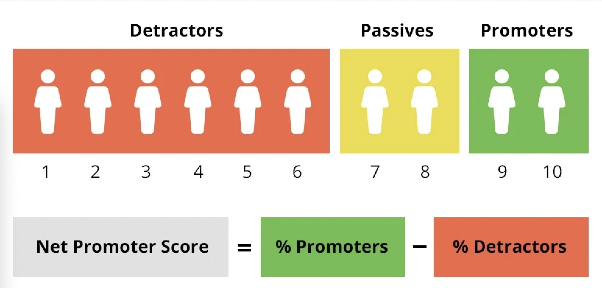

# nps-net-promoter-score php class

Here is my Php class that basically calculating the Net Prometer score.

## The formula
The nps php calculator class is using that main math equation.

## What is NPS
"Net promoter score is a widely used market research metric that typically takes the form of a single survey question asking respondents to rate the likelihood that they would recommend a company, product, or a service to a friend or colleague." [Wikipedia](https://en.wikipedia.org/wiki/Net_promoter_score)